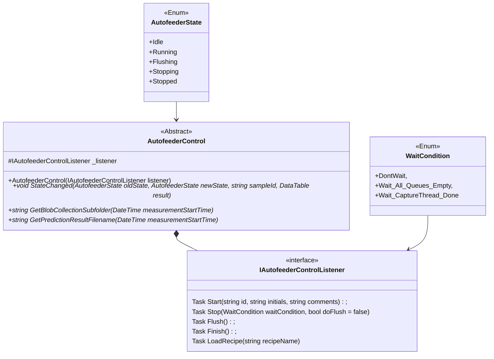

# VM.Lab.Interfaces.BlobAnalyzer
Defines common available interfaces to VideometerLab Blob analyzers, example blob analyzers are 

<!-- TOC -->
* [VM.Lab.Interfaces.BlobAnalyzer](#vmlabinterfacesblobanalyzer)
  * [Introduction](#introduction)
  * [AutofeederState](#autofeederstate)
  * [WaitCondition](#waitcondition)
  * [IAutofeederControlListener](#iautofeedercontrollistener)
  * [AutofeederControl](#autofeedercontrol)
<!-- TOC -->

## Introduction
Defines common available interfaces to VideometerLab Blob analyzers, example blob analyzers are
* VideometerLab Autofeeder blobAnalyzer
* VideometerLab X/Y blobAnalyzer

Notice, that interface is called Autofeeder* in many cases, this is due to legacy inheritance, the plugin can be used to controll both Autofeeder Blob analyzer and Videometerlab X/Y Blob Analyzer

The interface exposes the basic features that is available from the user interface

## AutofeederState
Represents the state of the autofeeder, used to communicate state transitions to the controller

## WaitCondition
Defines how to wait when stopping. 

## IAutofeederControlListener
Interface to control an __autofeeder__ from an external plugin, the plugin could be used to control any granularDevice, but for now it is used for the autofeeder 

## AutofeederControl
Autofeeder communication controller, Types that implement this class will be detected and gives the implementer the ability to control the Autofeeder

Control loop for Blob Analyzers, the diagram shows when the Start,Stop and Flush command are possible, 


Class diagram overview


```csharp
public interface IAutofeederControlListener
{
    /// <summary>
    /// Loads a recipe
    /// if an absolute path (local or cloud), the recipe is loaded given the absolute path
    /// if not an absolute path, the recipe is loaded from the current active workspace
    /// </summary>
    /// <param name="recipeName"></param>
    /// <returns></returns>
    Task LoadRecipe(string recipeName);
    
    /// <summary>Start a new measurement</summary>
    /// <param name="id">ID of the sample</param>
    /// <param name="initials">Operator initials</param>
    /// <param name="comments">Operator comments</param>
    Task Start(string id, string initials, string comments);

    /// <summary>Stop/Pause the current measurement</summary>
    /// <param name="waitCondition">What to wait on when stopping</param>
    /// <param name="doFlush">Controls if a flush is done during stopping of the autofeeder.
    /// This is wanted e.g. in the case of stopping due to low coverage.</param>
    Task Stop(WaitCondition waitCondition, bool doFlush = false);

    /// <summary>Flush the conveyor</summary>
    Task Flush();

    /// <summary>Finish the actual measurement</summary>
    Task Finish();
}
```
